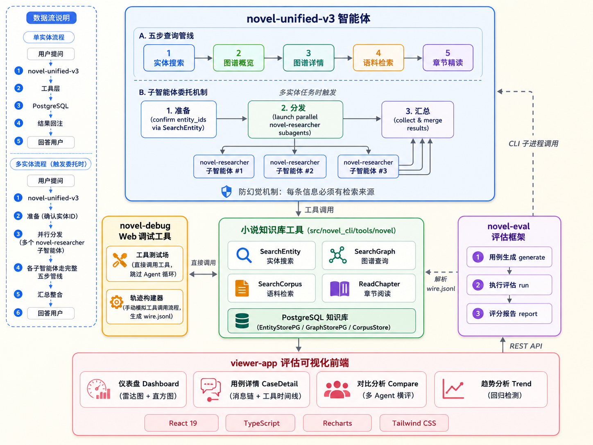

# Novel CLI

Novel CLI 是一个基于多 LLM Provider 的**小说知识库 CLI Agent** 工具。支持智谱 AI、Kimi、Anthropic、OpenAI、Google GenAI、OpenRouter 等多个平台，提供交互式 Shell、Web 界面、ACP 协议等多种使用方式。

本项目基于 [Kimi CLI](https://github.com/MoonshotAI/kimi-cli) 进行二次开发，继承了其 CLI Agent 核心框架、Soul 抽象层、Web 界面等基础设施。

---

## 架构概览



Novel CLI 采用五层架构设计：

- **智能体层** — novel-unified-v3 Agent，五步查询管线 + 子智能体委托
- **核心工具层** — 4 大知识库工具（SearchEntity / SearchGraph / SearchCorpus / ReadChapter）+ PostgreSQL 存储
- **调试工具** — novel-debug Web 调试（工具测试场 + 轨迹构建器）
- **评估框架** — novel-eval（用例生成 → 执行评估 → 评分报告）
- **可视化前端** — viewer-app（Dashboard / CaseDetail / Compare / Trend）

数据流：用户提问 → Agent 五步管线 → 工具层 → PostgreSQL → 结果回注 → 回答用户

---

## 核心设计

### Agent 系统

Novel CLI 的 Agent 系统基于 Soul 抽象层，支持内置和 YAML 声明式外置 Agent：

- **Soul 抽象层** — CLI / Web / ACP 三种界面统一入口，Agent 与前端解耦
- **内置 Agent** — `default` 基础 Agent（`--agent default`）
- **外置 Agent** — YAML 声明式配置，放置在 `agents/` 目录

#### novel-unified-v3（主力版本）

v3 是当前主力 Agent，核心机制：

**五步查询管线** — 严格的顺序检索，每步输出为下一步输入：

```
实体搜索 → 图谱概览 → 图谱详情 → 语料检索 → 章节精读
```

**子智能体委托** — 多实体任务时自动触发：

```
准备（确认 entity_ids） → 分发（并行启动 novel-researcher） → 汇总（收集合并结果）
```

**防幻觉机制** — 强制要求每条信息必须有检索来源，不得编造。

**工具集**（11 个）：AskUserQuestion、ReadFile、WriteFile、StrReplaceFile、Glob、Grep、SearchEntity、SearchGraph、SearchCorpus、ReadChapter、Agent（子智能体委托，v3 新增）

#### novel-unified-v2 对比

| 维度 | v2 | v3 |
|------|----|----|
| 工具数量 | 10 | 11（新增 Agent） |
| 子智能体 | 不支持 | 支持 novel-researcher |
| 多实体处理 | 串行查询 | 并行委托 |
| 复杂任务能力 | 中等 | 高 |

```bash
novel-cli --agent-file agents/novel-unified-v3/agent.yaml --book 西游记
```

> 详细的 Agent 开发指南见 [Agent 开发指南](docs/user-guide/agent-guide.md)

### 知识库工具链

`src/novel_cli/tools/novel/` 提供四个专用工具，构成完整的小说知识库检索能力：

| 工具 | 说明 | 关键参数 |
|------|------|----------|
| **SearchEntity** | 实体搜索（人物、物品、势力） | query, search_mode (vector/name), top_k |
| **SearchGraph** | 关系图谱查询 | entity_id, rel_type |
| **SearchCorpus** | 关键词语料检索 | keyword, chapter_ids, context_size |
| **ReadChapter** | 章节精读（句级范围） | chapter_id, start, end |

存储层基于 PostgreSQL，包含 EntityStorePG、GraphStorePG、CorpusStore 三个存储引擎。

工具间协作关系：
- SearchEntity 返回 entity_id → 供 SearchGraph 使用
- SearchGraph 返回 chapter_ids → 供 SearchCorpus 使用
- ReadChapter 作为补充，在 SearchCorpus 结果不足时精读原文

### 评估框架

`packages/novel_eval` + `viewer-app` 构成完整的评估体系：

**双评估任务：**

| 任务 | 评估对象 | 评分维度 |
|------|----------|----------|
| tool_usage | 工具使用质量 | tool_selection / param_quality / call_efficiency / result_utilization |
| skill_generation | 设定生成能力 | 上述 4 维度 + setting_completeness + format_compliance |

**三步流程：**

```bash
novel-eval generate --task tool_usage --book 凡人修仙传  # 用例生成
novel-eval run cases.yaml                                # 执行评估
novel-eval view                                          # 可视化查看
```

**viewer-app 四页面：**
- Dashboard — 雷达图 + 直方图 + 错误模式统计
- CaseDetail — 消息链 + 工具时间线 + 评分拆解
- Compare — 多 Agent 横评对比
- Trend — 时间趋势 + 回归检测

> 详细使用指南见 [评估框架指南](docs/user-guide/eval-guide.md)

**评估结果分析 Skill** — Claude Code 内置的 `agent-eval-analyzer` Skill 可自动分析评估结果，从工具选择、参数质量、调用效率、结果利用四个维度定位优化方向，输出结构化问题清单到 `docs/agent-issues/`。在 Claude Code 中直接说"分析 agent 评估结果"即可触发。

### 调试工具

`src/novel_debug` 提供 Web 调试界面，两个核心功能：

- **工具测试场** — 直接调用 SearchEntity / SearchGraph / SearchCorpus，跳过 Agent 循环，快速验证工具行为
- **轨迹构建器** — 手动模拟工具调用流程，生成 wire.jsonl，适用于构建评估黄金轨迹

```bash
uv run python -m novel_debug        # 启动调试 Web 界面（默认 http://localhost:9004）
```

> 详细使用指南见 [调试工具指南](docs/user-guide/debug-guide.md)

### Web 界面

`web/` 提供浏览器端的完整对话体验：

**技术栈：** React 19 + TypeScript + Vite + Tailwind CSS + Radix UI

**核心特性：**
- 书籍选择器 — 自动列出知识库书籍，切换分析目标
- Agent 切换 — 启动时通过 `--agent` / `--agent-file` 指定
- 会话管理 — 创建 / 删除 / 重命名 / 归档 / 分支（fork）
- 实时对话 — WebSocket 流式通信，工具调用审批
- 文件管理 — 上传 / 下载 / Git diff 查看

```bash
novel-cli web                                          # 本地访问
novel-cli web --network                                # 局域网访问
novel-cli web --public --auth-token secret             # 公网访问
novel-cli web --book 西游记 --agent default            # 指定书籍和 Agent
```

> 详细使用指南见 [Web 界面指南](docs/user-guide/web-guide.md)

---

## 模块导航

| 模块 | 路径 | 说明 | 详细文档 |
|------|------|------|----------|
| 核心 CLI | `src/novel_cli/` | Agent 运行时、LLM 抽象、会话管理 | [CLI 参考](docs/user-guide/cli-reference.md) |
| 知识库工具 | `src/novel_cli/tools/novel/` | 4 大搜索工具 | [CLI 参考](docs/user-guide/cli-reference.md) |
| Web 界面 | `web/` | React 前端 + FastAPI 后端 | [Web 指南](docs/user-guide/web-guide.md) |
| 评估框架 | `packages/novel_eval/` | 用例生成、执行评估、评分报告 | [评估指南](docs/user-guide/eval-guide.md) |
| 可视化前端 | `viewer-app/` | 评估结果可视化 | [评估指南](docs/user-guide/eval-guide.md) |
| 调试工具 | `src/novel_debug/` | 工具测试场、轨迹构建器 | [调试指南](docs/user-guide/debug-guide.md) |
| Agent 配置 | `agents/` | 外置 Agent 规格文件 | [Agent 指南](docs/user-guide/agent-guide.md) |
| 配置文件 | `~/.novel/config.toml` | Provider / Model / 行为偏好 | [配置详解](docs/user-guide/config-reference.md) |

---

## 快速上手

```bash
# 1. 安装
uv sync

# 2. 配置环境变量
cp docker/.env.example docker/.env
# 编辑 docker/.env，修改 POSTGRES_PASSWORD 和 EMBEDDING_API_KEY

# 3. 启动数据库
cd docker && docker compose -p novel-cli up -d && cd ..

# 4. 导入数据
uv run python scripts/import_pg_data.py tables create
uv run python scripts/import_pg_data.py import --book 西游记

# 5. 配置 Provider
novel-cli setup

# 6. 开始使用
novel-cli --book 西游记
```

> 完整安装和配置指南见 [快速上手](docs/user-guide/quickstart.md)

---

## 致谢

本项目基于 [Kimi CLI](https://github.com/MoonshotAI/kimi-cli) 二次开发，继承了其 CLI Agent 核心框架、Soul 抽象层、Web 界面等基础设施。[LICENSE](LICENSE) (Apache 2.0) 和 [NOTICE](NOTICE) 均继承自上游项目。
