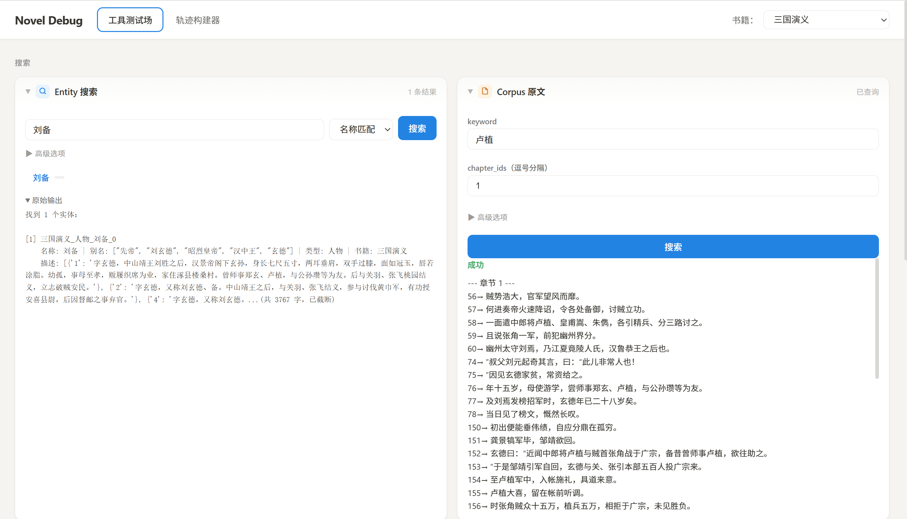
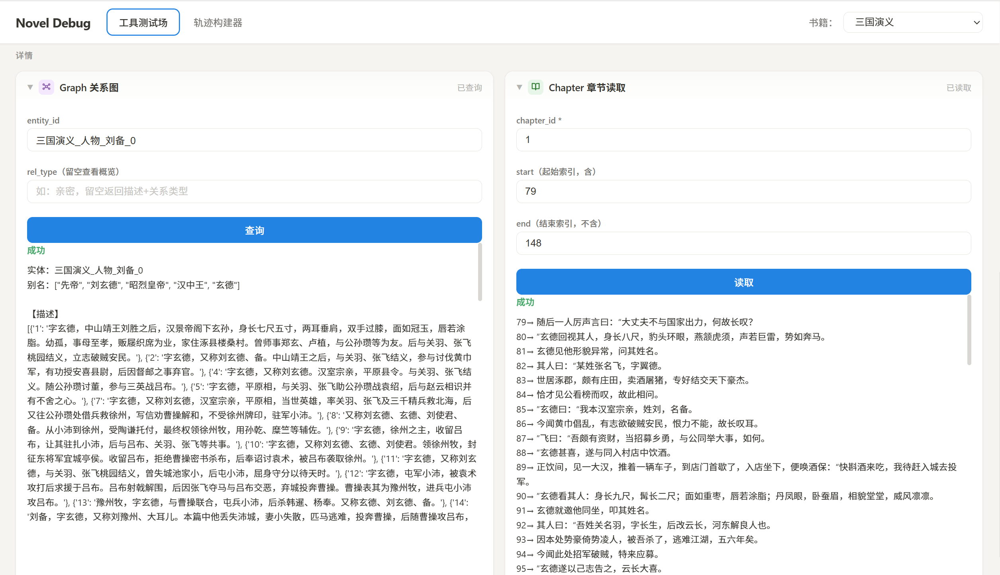
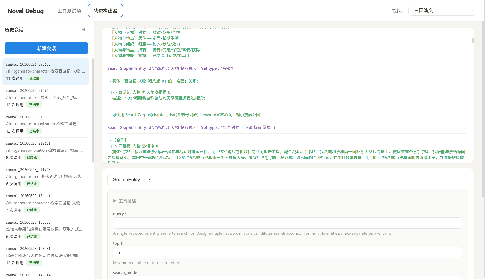

# 调试工具使用指南

## 概述

`novel_debug` 是 Novel CLI 的 Web 调试工具，提供两个核心功能：

1. **工具测试场** -- 直接调用知识库工具，跳过 Agent 循环
2. **轨迹构建器** -- 手动模拟工具调用流程，生成 `wire.jsonl`

## 启动

```bash
# 启动 debug 服务（确保数据库已运行，工具调用依赖 NovelStore）
uv run python -m novel_debug
```

服务默认监听 `0.0.0.0:9004`，启动后访问 http://localhost:9004 即可使用 Web 界面。

默认端口为 `9004`，如需修改可编辑 `src/novel_debug/__main__.py` 中的 `port` 参数。

## 工具测试场

工具测试场允许直接调用 SearchEntity、SearchGraph、SearchCorpus、ReadChapter 四个知识库工具，无需经过 Agent 循环。

### 使用方式

1. 在顶部 **书籍** 下拉框中选择目标书籍
2. 左侧 **工具列表** 点击要测试的工具
3. 填写参数表单（`book` 字段会自动注入，无需手动填写）
4. 点击 **执行**，查看返回结果




### API 端点

| 方法 | 端点 | 说明 |
|------|------|------|
| GET | `/api/tools` | 获取工具列表及参数定义（JSON Schema） |
| GET | `/api/books` | 获取已入库书籍列表 |
| POST | `/api/tools/{name}/call` | 直接调用指定工具 |

### 支持的工具

| 工具 | 说明 | 关键参数 |
|------|------|----------|
| SearchEntity | 实体搜索 | `query`, `search_mode`（`vector` 语义搜索 / `name` 精确名称搜索）, `top_k` |
| SearchGraph | 图谱查询 | `entity_id`（格式：`书名_类型_名称_序号`）, `rel_type` |
| SearchCorpus | 语料检索 | `keyword`, `chapter_ids`, `context_size` |
| ReadChapter | 章节阅读 | `chapter_id`, `start`, `end` |

### 调用示例

```bash
# 调用 SearchEntity：语义向量搜索「韩立」
curl -X POST http://localhost:9004/api/tools/SearchEntity/call \
  -H "Content-Type: application/json" \
  -d '{"params": {"query": "韩立", "search_mode": "vector", "top_k": 5}, "book": "凡人修仙传"}'

# 调用 SearchGraph：查询韩立的知识图谱关系
curl -X POST http://localhost:9004/api/tools/SearchGraph/call \
  -H "Content-Type: application/json" \
  -d '{"params": {"entity_id": "凡人修仙传_character_韩立_0"}, "book": "凡人修仙传"}'

# 调用 SearchCorpus：搜索「筑基丹」相关段落
curl -X POST http://localhost:9004/api/tools/SearchCorpus/call \
  -H "Content-Type: application/json" \
  -d '{"params": {"keyword": "筑基丹", "context_size": 2}, "book": "凡人修仙传"}'

# 调用 ReadChapter：读取第 1 章前 50 句
curl -X POST http://localhost:9004/api/tools/ReadChapter/call \
  -H "Content-Type: application/json" \
  -d '{"params": {"chapter_id": 1, "start": 0, "end": 50}, "book": "凡人修仙传"}'
```

> 注意：API 请求体需包含 `params`（工具参数字典）和可选的 `book`（书名，自动注入到参数中）。

## 轨迹构建器

轨迹构建器用于手动模拟 Agent 的工具调用流程，逐步构建 `wire.jsonl` 轨迹文件。适用于：

- 构建评估黄金轨迹（eval case）
- 测试和调试工具调用链
- 生成 Agent 训练数据

### 使用流程

1. **新建会话** -- 点击左侧「新建会话」，输入用户问题，点击「开始」
2. **调用工具** -- 在底部工具栏选择工具、填写参数，点击「调用」，工具结果会自动追加到时间线
3. **撤回操作** -- 如果调用结果不理想，点击「撤回上一步」删除最后一次操作
4. **粘贴模型回答** -- 将外部 LLM 的回答粘贴到文本框，点击「提交回答」
5. **结束轮次** -- 点击「结束轮次」写入 TurnEnd 并关闭当前轮次
6. **导出轨迹** -- 生成 `wire.jsonl` 或获取可复制的轨迹文本



### Skill 前缀展开

创建会话时，用户输入支持 `/skill:xxx` 前缀自动展开。格式为：

```
/skill:<skill名> <用户参数>
```

例如：

- 输入：`/skill:generate-character 检索韩立相关信息后生成角色设定`
- 展开后的实际内容：用户参数 + SKILL.md 完整内容

内置 skills 从 `src/novel_cli/skills/` 目录加载，当前可用的 skill 包括：

- `generate-character` -- 生成角色设定
- `generate-item` -- 生成物品描述
- `generate-organization` -- 生成组织描述
- `generate-location` -- 生成地点描述
- `generate-skill` -- 生成技能描述
- `skill-creator` -- 创建新 skill
- `novel-cli-help` -- Novel CLI 使用帮助

### 历史会话

左侧边栏展示所有历史会话，点击可恢复查看时间线。会话数据存储在 `sessions/` 目录下，每个会话一个子目录，包含一个 `wire.jsonl` 文件。

### API 端点

| 方法 | 端点 | 说明 |
|------|------|------|
| GET | `/api/sessions` | 列出所有历史会话 |
| GET | `/api/sessions/{id}/timeline` | 获取会话时间线事件列表 |
| POST | `/api/sessions` | 创建新会话（请求体：`user_input`, `book`） |
| POST | `/api/sessions/{id}/tool-call` | 追加工具调用（请求体：`tool_name`, `arguments`, `book`） |
| POST | `/api/sessions/{id}/undo` | 撤回上一步操作 |
| POST | `/api/sessions/{id}/text` | 追加 Agent 文本回复（请求体：`text`） |
| POST | `/api/sessions/{id}/end` | 结束当前轮次 |
| GET | `/api/sessions/{id}/wire` | 导出 `wire.jsonl` 原始内容 |
| GET | `/api/sessions/{id}/copy` | 获取人类可读的轨迹摘要文本 |
| GET | `/api/sessions/{id}/copy-with-tools` | 获取含工具定义的轨迹上下文（用于 LLM 预测下一步工具调用） |
| DELETE | `/api/sessions/{id}` | 删除会话及其目录 |

### 撤回机制

撤回操作根据最后一条事件的类型有不同的行为：

| 最后事件类型 | 撤回行为 |
|-------------|---------|
| ToolResult | 撤回 ToolCall + ToolResult 配对 |
| ContentPart | 撤回模型文本回答 |
| TurnEnd | 撤回轮次结束标记 |

### Wire 格式事件类型

`wire.jsonl` 文件中每行一个 JSON 对象，包含以下事件类型：

| 事件类型 | 说明 | 关键字段 |
|----------|------|---------|
| `metadata` | 协议头部 | `protocol_version` |
| `TurnBegin` | 用户输入开始 | `user_input`, `original_input`（skill 展开前的原始输入） |
| `ToolCall` | 工具调用 | `id`（如 `tc_1`）, `function.name`, `function.arguments` |
| `ToolResult` | 工具返回值 | `tool_call_id`, `return_value` |
| `ContentPart` | Agent 文本回复 | `type: "text"`, `text` |
| `TurnEnd` | 轮次结束 | -- |

### 轨迹导出格式

**wire.jsonl**：原始 JSONL 格式，每行一个完整的 JSON 事件对象，可直接用于评估系统加载。

**复制轨迹（copy）**：人类可读的文本摘要，格式如下：

```
用户问题：<展开后的完整用户输入>

[工具调用] SearchEntity({"query": "韩立", "search_mode": "vector", "top_k": 5})
[工具结果] <工具返回的文本内容>

[模型回答] <粘贴的 LLM 文本回复>

--- 轮次结束 ---

请按工具结果回复用户的问题，如果当前信息不够，就说根据当前工具调用结果无法回答
```

**复制轨迹含工具定义（copy-with-tools）**：在轨迹文本前附加可用工具的参数定义，用于让外部 LLM 预测下一步应调用的工具和参数。

## 模块结构

```
src/novel_debug/
  __init__.py       # 包声明
  __main__.py       # 入口：启动 uvicorn 服务（默认 0.0.0.0:9004）
  app.py            # FastAPI 路由与中间件
  session.py        # 会话管理（创建/追加/撤回/导出）
  tools.py          # 工具封装层（绕过 agent 直接调用工具类）
  wire_format.py    # wire.jsonl 消息格式生成
  static/
    index.html      # 页面结构
    app.js          # 前端交互逻辑
    style.css       # 样式
```

## 会话数据存储

```
sessions/
  manual_20260515_180341/
    wire.jsonl          # 轨迹文件（JSONL 格式）
  manual_20260516_093000/
    wire.jsonl
```

会话 ID 格式为 `manual_YYYYMMDD_HHMMSS`，按创建时间自动生成。
