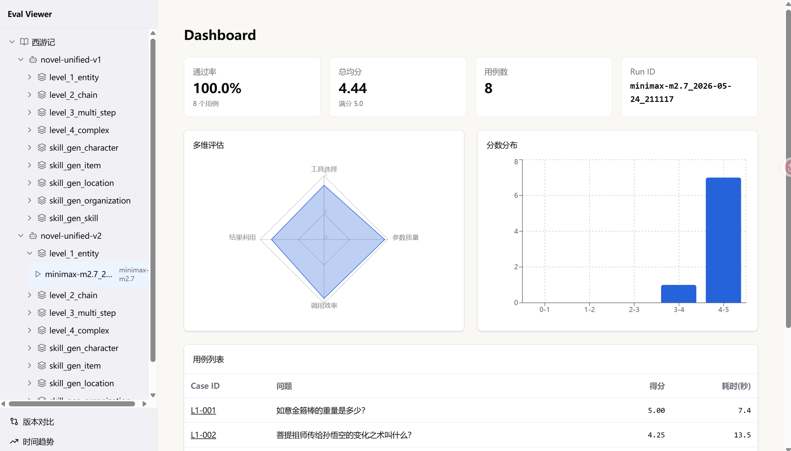
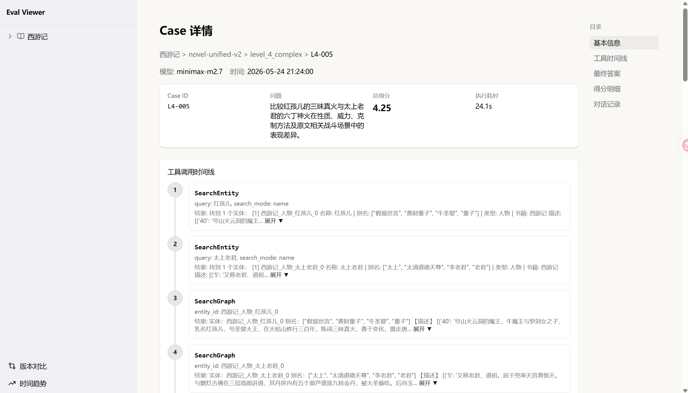
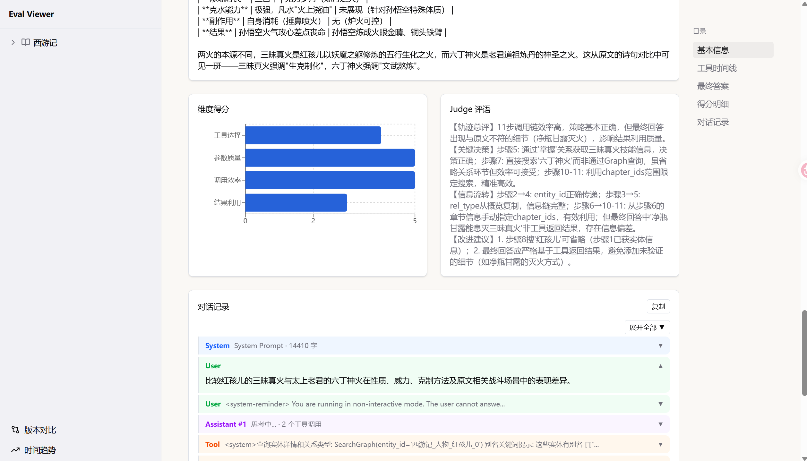
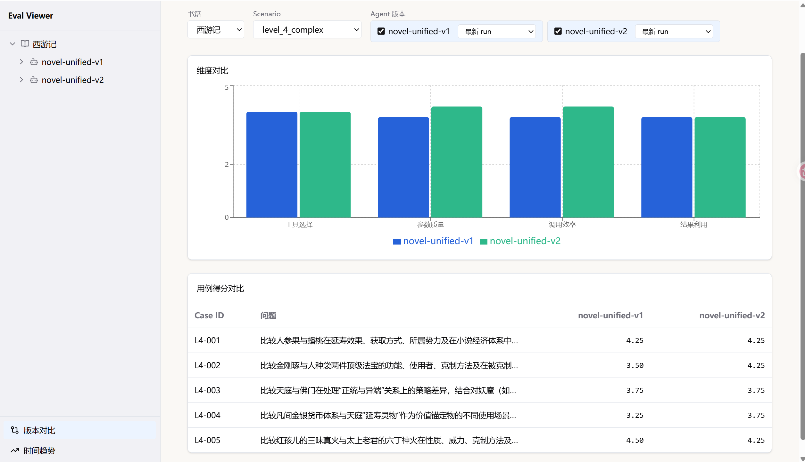

# 评估框架使用指南

## 概述

`novel_eval` 是 Novel CLI 的 Agent 评估框架，支持两种评估任务：

| 任务类型 | 评估对象 | 评分维度 |
|----------|----------|----------|
| `tool_usage` | Agent 工具使用质量 | 4 维度 |
| `skill_generation` | Agent 设定生成能力 | 5 维度 |

## 安装

```bash
cd packages/novel_eval
uv sync
```

或作为 workspace 子包直接使用。

## 前置条件

评估运行时 Agent 会调用知识库工具查询数据库，因此需要先完成以下准备：

1. **配置数据库环境变量**：`cp docker/.env.example docker/.env` 并填写 `POSTGRES_*` 和 `EMBEDDING_*` 配置（详见 [快速上手](quickstart.md)）
2. **启动数据库**：`cd docker && docker compose -p novel-cli up -d`
3. **导入书籍数据**：`uv run python scripts/import_pg_data.py import --book 西游记`
4. **配置 LLM Provider**：`novel-cli setup`
5. **配置评估 API Key**：`cp .env.example .env`，在 `.env` 中填入 `EVAL_API_KEY`（评估框架通过此环境变量获取 Agent 和 Judge 的 API Key）

## 评估流程

评估分为三步：**用例生成 -> 执行评估 -> 评分报告**

### 1. 用例生成 (generate)

```bash
# 生成 tool_usage 评估用例
novel-eval generate --task tool_usage --book 凡人修仙传 --scenario level_1_entity

# 生成 skill_generation 评估用例
novel-eval generate --task skill_generation --book 凡人修仙传 --samples 10

# 指定输出目录
novel-eval generate --task tool_usage --output ./my_eval_cases

# 追加模式（不覆盖已有用例）
novel-eval generate --task tool_usage --append

# 自定义生成方向
novel-eval generate --task tool_usage --instruction "只生成关于韩立的用例"
```

**generate 参数：**

| 参数 | 缩写 | 说明 | 默认值 |
|------|------|------|--------|
| `--config` | `-c` | 配置文件路径 | 无 |
| `--task` | `-t` | 评估任务类型 | `tool_usage` |
| `--book` | `-b` | 书籍名称 | `凡人修仙传` |
| `--output` | `-o` | 输出目录 | `eval_cases` |
| `--scenario` | `-s` | 场景名称 | `level_1_entity` |
| `--instruction` | `-i` | 自定义生成指令 | 无 |
| `--seed` | | 随机种子（可复现） | 无 |
| `--samples` | | 每类样本数（`skill_generation`） | 无 |
| `--append` | `-a` | 追加模式 | `false` |

### 2. 执行评估 (run)

```bash
# 执行评估
novel-eval run eval_cases/tool_usage_cases.yaml

# 指定结果输出目录
novel-eval run eval_cases/tool_usage_cases.yaml --output ./my_results

# 跳过执行，仅重新评分
novel-eval run --skip-run --result-dir ./eval_results/...

# 重跑缺失用例
novel-eval run --rerun-missing --result-dir ./eval_results/...
```

**run 参数：**

| 参数 | 缩写 | 说明 | 默认值 |
|------|------|------|--------|
| `yaml` | | 测试用例 YAML 文件路径（支持多个） | 无（运行时校验不可为空） |
| `--config` | `-c` | 配置文件路径 | 无 |
| `--task` | `-t` | 评估任务类型 | `tool_usage` |
| `--output` | `-o` | 结果输出目录 | `eval_results` |
| `--skip-run` | | 跳过执行，仅评分 | `false` |
| `--result-dir` | `-r` | 已有结果目录（`skip-run` / `rerun-missing` 时需要） | 无 |
| `--rerun-missing` | | 重跑缺失用例 | `false` |

### 3. 评分报告 (report)

评估执行完成后自动生成评分报告，目录结构如下：

```
eval_results/
└── {book}/
    └── {agent}/
        └── {scenario}/
            └── {model}_{timestamp}/
                ├── report.json      # 评分报告（JSON 格式）
                ├── report.md        # 可读报告（Markdown 格式）
                └── cases/
                    └── {case_id}.json  # 各用例详情
```

### 其他命令

```bash
# 提取上下文消息
novel-eval extract-context --result-dir ./eval_results/...

# 重新生成报告（不重跑评估）
novel-eval regen-report --result-dir ./eval_results/...
```

## tool_usage 评估

### 评分维度

| 维度 | 说明 |
|------|------|
| `tool_selection` | 工具选择正确性 |
| `param_quality` | 参数构造质量 |
| `call_efficiency` | 调用链效率 |
| `result_utilization` | 结果利用完整性 |

每个维度 1-5 分，取加权平均作为总分。

### 难度等级与黄金轨迹

| 等级 | 典型轨迹 | 调用次数 | 场景 |
|------|----------|----------|------|
| L1 | Entity -> Corpus | 2-3 | 简单事实查询 |
| L2 | Entity -> Graph(概览) -> Graph(详情) -> Corpus | 4-5 | 关系查询 |
| L3 | Entity -> Graph -> Corpus x retry -> ReadChapter | 6-8 | 深度分析 |
| L4 | 多实体并行 -> Graph x N -> Corpus x N -> ReadChapter | 10-14 | 复杂推理 |

### 错误模式检测

| 模式 | 说明 |
|------|------|
| `infinite_loop` | 相同参数重复调用 5 次以上 |
| `null_params` | 必要参数为空 |
| `no_tool_use` | 整个轨迹无工具调用 |
| `wrong_tool_order` | 违反五步管线顺序 |
| `result_ignored` | 连续空结果后继续搜索 |

## skill_generation 评估

### 评分维度

| 维度 | 说明 |
|------|------|
| `tool_selection` | 工具选择合理性 |
| `param_quality` | 参数构造精确度 |
| `call_efficiency` | 调用链效率 |
| `setting_completeness` | 设定文档完整性 |
| `format_compliance` | SKILL.md 模板格式合规性 |

### 设定类型与黄金轨迹

| 类型 | 典型轨迹 | 调用次数 |
|------|----------|----------|
| `character` | Entity -> Graph x 3 -> Corpus x 5-8 -> WriteFile | 7-11 |
| `item` | Entity -> Graph x 3 -> Corpus x 4 -> WriteFile | 6 |
| `location` | Entity -> Graph x 3 -> Corpus x 6 -> WriteFile | 8 |
| `organization` | Entity -> Graph x 4 -> Corpus x 5 -> WriteFile | 12 |
| `skill` | Entity -> Graph x 4 -> Corpus + ReadChapter -> WriteFile | 12 |

## 评估配置 (eval_config.yaml)

```yaml
agent:
  model: deepseek-v3
  api_key_env: AGENT_API_KEY
  base_url: ...

runner:
  work_dir: ~/novel_test
  agent_file: agents/novel/agent.yaml  # 根据实际 agent 版本填写
  timeout: 60

judge:
  model: claude-sonnet-4-20250514
  api_key_env: JUDGE_API_KEY
  base_url: ...

concurrency: 2
```

## viewer-app 可视化前端

### 启动

```bash
novel-eval view                       # 默认端口 8080
novel-eval view --port 3000           # 指定端口
novel-eval view --host 0.0.0.0        # 指定监听地址
novel-eval view --eval-dir ./results  # 指定结果目录
novel-eval view --no-open             # 不打开浏览器
novel-eval view --dev                 # 开发模式（跳过静态文件挂载）
```

### 四个页面

**Dashboard（仪表盘）**



- 雷达图展示各维度评分
- 直方图展示分数分布
- 错误模式统计
- 改进建议

**CaseDetail（用例详情）**




- 消息链完整记录
- 工具调用时间线
- 评分细项拆解
- 工具统计信息

**Compare（对比分析）**



- 多 Agent 版本横向对比
- 各维度对比图表
- 历史版本差异


### 技术栈

React 19 + TypeScript + Vite + Tailwind CSS + Recharts

## 评估结果分析（agent-eval-analyzer Skill）

项目内置了 Claude Code Skill `agent-eval-analyzer`，可自动分析评估结果并输出结构化优化建议。

### 功能

- 读取 Agent 配置（agent.yaml / system.md）和工具实现代码
- 逐 case 分析工具调用轨迹，识别冗余调用、无效调用、策略偏差等问题
- 对照 system prompt 规则进行归因分析（System Prompt / 工具输出 / 工具参数 / Agent 推理）
- 输出按优先级（P0/P1/P2）排序的问题清单到 `docs/agent-issues/`

### 使用方式

在 Claude Code 中直接用自然语言触发：

```
分析 agent 评估结果
```

或提供具体路径：

```
帮我分析 eval_results/凡人修仙传/novel-v3/level_1_entity/ 下的评估结果
```

### 分析维度

| 维度 | 说明 |
|------|------|
| 工具选择 | Agent 是否选择了正确的工具 |
| 参数质量 | 参数构造是否精确、合理 |
| 调用效率 | 是否存在冗余、过度探索 |
| 结果利用 | 工具返回的结果是否被充分利用 |

### 输出示例

分析结果写入 `docs/agent-issues/<eval_name>.md`，格式包含：

- 各维度得分概览
- 按优先级排序的问题清单（现象 → 根因 → 建议方案）
- 各 case 得分与调用摘要表
- 最高分 case 的最优流程模板
