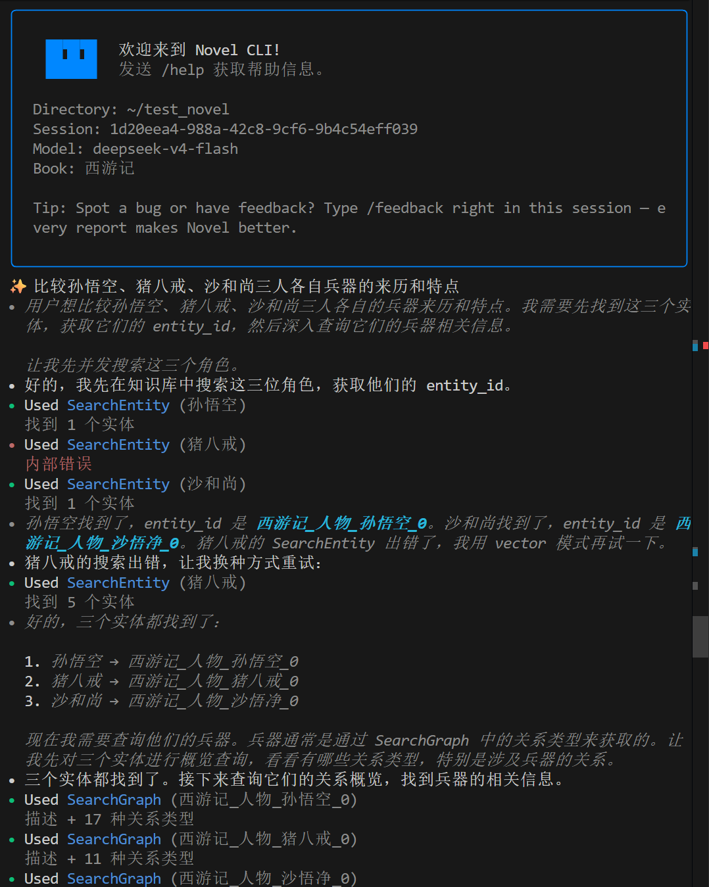

# 快速上手

## 系统要求

- Python >= 3.12
- 推荐使用 [uv](https://docs.astral.sh/uv/) 作为包管理器

## 安装

### 快速安装

```bash
# 克隆仓库
git clone https://github.com/hrjlab/novel-cli.git
cd novel-cli

# 使用 uv 安装依赖并运行
uv sync
uv run novel-cli --help
```

### 全局安装（可选）

如果你想在任意目录直接运行 `novel-cli` 命令：

```bash
# 使用 uv tool 安装
uv tool install . --force --reinstall

# 之后可以直接运行
novel-cli --help
```

## 配置环境变量

```bash
cp docker/.env.example docker/.env
```

编辑 `docker/.env`，至少需要修改以下内容：

```bash
# PostgreSQL 配置（请修改密码）
POSTGRES_PASSWORD=changeme_pgsql

# Embedding 模型配置（向量导入时需要，填入你的 API Key）
EMBEDDING_API_URL=https://api.siliconflow.cn/v1
EMBEDDING_API_KEY=sk-xxxx
```

> 其余配置项保持默认即可。完整的配置说明见 [docker/README.md](../../docker/README.md)。

## 启动数据库

> **重要**：必须指定 `-p novel-cli` 项目名称。Docker Compose 默认以目录名作为 project name，本项目的 compose 文件位于 `docker/` 目录，与本机其他项目的 `docker/` 目录同名，不指定 project name 会导致容器互相覆盖。

```bash
cd docker
docker compose -p novel-cli up -d
```

确认数据库正常运行（状态为 `healthy`）：

```bash
docker compose -p novel-cli ps
```

停止数据库：

```bash
docker compose -p novel-cli down
```

## 首次配置

首次运行 `novel-cli` 时，如果未配置任何 Provider，会自动启动引导向导。完成初始配置后，你可以随时通过 `novel-cli setup` 管理配置。

```bash
# 进入交互主菜单
novel-cli setup

# 或直接跳转到指定模块
novel-cli setup provider   # 管理 Provider
novel-cli setup model      # 管理 Model
novel-cli setup prefs      # 编辑偏好设置
novel-cli setup services   # 配置服务 (novel_db)
novel-cli setup wizard     # 完整引导向导（首次用户）
```

### 交互主菜单

不带参数运行 `novel-cli setup` 会进入主菜单：

```
═══════════════════════════════════════════
       Novel CLI 配置管理
═══════════════════════════════════════════

 请选择操作 (↑↓ 导航, Enter 选择, Ctrl+C 退出):
   >  1. 管理 Provider
      2. 管理 Model
      3. 编辑偏好设置
      4. 配置服务 (novel_db)
      5. 首次引导向导
      6. 退出
```

### 首次引导向导

首次运行（无 Provider、无 Model）会自动进入引导向导，也可通过 `novel-cli setup wizard` 手动触发。向导包含 5 个步骤：

**Step 1: 选择 Provider**

| 分组 | 可选平台 |
|------|----------|
| 国内平台 | 智谱 AI、Kimi (Moonshot CN)、Moonshot AI |
| 国际平台 | Anthropic、Google GenAI、OpenAI、OpenRouter |
| 自定义 | 自行配置 DeepSeek、Qwen、Groq 等 |


**Step 2: 连接参数**
- API Key（密码模式输入，不可见）
- Base URL（内置 Provider 自动预填，可修改）

**Step 3: 添加模型**
- 支持循环添加多个模型
- **模型能力配置**（循环选择）：
  - `thinking` - 支持思考模式（默认勾选）
  - `image_in` - 支持图像输入（多模态）
  - `video_in` - 支持视频输入
  - `always_thinking` - 强制思考模式
  - `thinking` 与 `always_thinking` 互斥，选择一个会自动取消另一个

**Step 4: 行为偏好**
- Thinking 模式 - 模型深度思考后再回答
- YOLO 模式 - 自动批准工具调用
- 终端主题 - dark / light

**Step 5: 确认保存**
展示配置摘要，确认后写入 `~/.novel/config.toml`

> 向导采用追加模式，已有配置不会被修改。如需重来，用 `novel-cli setup provider` 删除后重加即可。

### Provider 管理

```
── Provider 管理 ──

 Provider 管理 (↑↓ 导航, Enter 选择, Ctrl+C 返回):
   >  1. 查看已有 Provider
      2. 添加 Provider
      3. 编辑 Provider
      4. 删除 Provider
      5. 返回
```

**查看**：列出所有已配置 Provider，API Key 脱敏显示：

```
已配置的 Provider：

  1. zhipu (智谱 AI)
     type: zhipu | base_url: http://192.168.0.199:4000/v1/
     api_key: sk-***...***P2v

  2. openrouter (OpenRouter)
     type: openrouter | base_url: https://openrouter.ai/api/v1
     api_key: sk-***...***ff3
```

**添加**：选分组 → 选平台或自定义 → 输入 API Key / Base URL：

```
 选择平台分组:
      1. 国内平台  (智谱 AI, Kimi, Moonshot AI)
      2. 国际平台  (Anthropic, OpenAI, Google GenAI, OpenRouter)
   >  3. 自定义 Provider  (DeepSeek, Qwen, Groq, ...)
 服务商名称 (如 deepseek, qwen, groq): deepseek
 选择 API 接口类型:
      1. OpenAI 兼容
   >  2. Anthropic 兼容
      3. Google GenAI 兼容
      4. OpenAI Responses API
 Base URL (如 https://api.deepseek.com/v1): https://api.deepseek.com/v1
 API Key: ******
Provider 已添加!
```

**编辑**：选择要编辑的 Provider，修改 API Key / Base URL / Provider Type

**删除**：选择 Provider → 确认。如果有关联 Model，会提示是否一并删除：

```
 选择要删除的 Provider:
      1. zhipu (zhipu)
      2. openrouter (openrouter)
      ...
 确认删除 Provider 'test'？
   >  1. 确认
      2. 取消
Provider 已删除!
```

### Model 管理

```
── Model 管理 ──

 Model 管理 (↑↓ 导航, Enter 选择, Ctrl+C 返回):
   >  1. 查看已有 Model
      2. 添加 Model
      3. 编辑 Model
      4. 删除 Model
      5. 返回
```

**查看**：按关联 Provider 分组展示，`*` 标记当前 default_model：

```
已配置的 Model：

  ── zhipu ──
    glm-4.7-flash   ctx: 202752   caps: thinking

  ── openrouter ──
    google/gemma-4-31b-it:free   ctx: 262000   caps: thinking
    minimax/minimax-m2.5:free   ctx: 197000   caps: thinking

  ── deepseek ──
    deepseek-v4-flash   ctx: 1000000   caps: thinking * ← default_model
```

**添加**：选择目标 Provider → 输入 model name → max_context_size → 选 capabilities

**编辑**：修改 max_context_size 或 capabilities

**删除**：确认删除。如果是当前 default_model，需先选择新的默认模型

### 偏好设置

直接列出所有偏好项，输入编号即可编辑：

```
╭─ 偏好设置 ──────────────────╮
│                              │
  1. default_model       → deepseek/deepseek-v4-flash
  2. default_thinking    → true
  3. default_yolo        → true
  4. default_plan_mode   → false
  5. default_editor      → (未设置)
  6. theme               → dark

  > 输入编号编辑，0 返回:
```

编辑行为：
- `default_model`：从已配置 Model 列表中选择
- `default_thinking` / `yolo` / `plan_mode`：开关切换
- `theme`：dark / light 二选一
- `default_editor`：文本输入，留空跟随系统

### 服务配置

直接展示 novel_db 连接参数和 Embedding 配置，输入编号编辑：

```
── 服务配置: novel_db ──

  ── PostgreSQL ──
  1. pg_host       → localhost
  2. pg_port       → 5433
  3. pg_db         → novel_graph_search
  4. pg_user       → novel_admin
  5. pg_password   → cha***...***sql

  ── Embedding ──
  6. embedding_api_url   → https://api.siliconflow.cn/v1
  7. embedding_api_key   → sk-***...***oac
  8. embedding_model     → Qwen/Qwen3-Embedding-4B
  9. embedding_dim       → 2560

  10. data_dir    → (留空则使用 ./data/input_data/)
  11. pg_pool_size → 15

 输入编号编辑，0 返回:
```

## 基本使用

### 启动交互式 Shell

```bash
# 直接启动，进入交互式对话
novel-cli

# 指定工作目录
novel-cli -w /path/to/project

# 指定书籍（启动时加载小说数据）
novel-cli --book 西游记

# 指定内置 Agent
novel-cli --agent default

# 使用外置 Agent 文件
novel-cli --agent-file agents/novel-unified-v3/agent.yaml

# 启用 Thinking 模式
novel-cli --thinking

# 自动批准所有工具调用（YOLO 模式）
novel-cli --yolo

# 继续上一个会话
novel-cli -C

# 恢复指定会话
novel-cli -S <session_id>
```

### 非交互模式（管道/脚本）

```bash
# 直接执行任务并退出
novel-cli -p "帮我分析当前目录的代码结构" --print

# 从 stdin 读取输入
echo "解释这个函数的作用" | novel-cli --print

# JSON 流式输出（适合程序调用）
novel-cli -p "生成一个 Python 函数" --print --output-format stream-json
```

### 小说知识库模式

```bash
# 加载小说并启动交互式 Shell
novel-cli --work-dir /home/user/novel_data --book 西游记

# 使用外置 Agent 分析小说
novel-cli --agent-file agents/novel-unified-v3/agent.yaml --book 西游记 --work-dir ./novel_data

# 使用思考模式分析小说人物关系
novel-cli --book 西游记 --thinking -p "分析孙悟空的性格特点"
```


### 导入小说数据

项目自带预处理好的书籍数据，存放在 `data/input_data/` 目录下，当前包含：

| 书籍 | 数据目录 |
|------|----------|
| 西游记 | `data/input_data/西游记/` |
| 三国演义 | `data/input_data/三国演义/` |

每本书包含四类数据文件：`_entities.csv`（实体）、`_relationships.csv`（关系）、`_entities_embed.csv`（向量）、`_corpus.json`（语料章节）。

使用 `scripts/import_pg_data.py` 脚本将数据导入到 PostgreSQL：

```bash
# 1. 首次使用：创建表结构
uv run python scripts/import_pg_data.py tables create

# 2. 导入书籍数据（含实体、关系、向量、语料）
uv run python scripts/import_pg_data.py import --book 西游记
uv run python scripts/import_pg_data.py import --book 三国演义

# 可选：跳过向量导入（不需要语义搜索时）
uv run python scripts/import_pg_data.py import --book 西游记 --skip-embedding

# 可选：删除某本书的数据
uv run python scripts/import_pg_data.py delete --book 西游记
```

> **Embedding 配置**：向量导入需要 Embedding API，脚本会自动从 `novel-cli setup services` 中读取配置，也可通过 `--api-url`、`--api-key` 参数指定。

## 下一步

- [CLI 命令参考](cli-reference.md) — 完整的命令和选项说明
- [Web 界面](web-guide.md) — 浏览器中使用 Novel CLI
- [评估框架](eval-guide.md) — Agent 效果评估
- [调试工具](debug-guide.md) — 工具测试和轨迹构建
- [Agent 开发](agent-guide.md) — 自定义 Agent
- [配置详解](config-reference.md) — 配置文件完整字段
