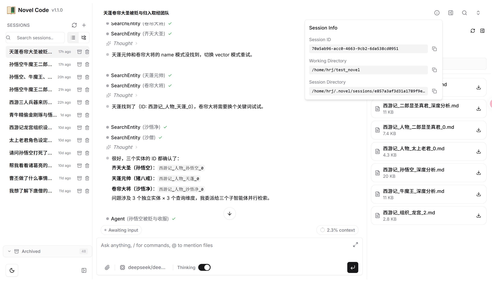
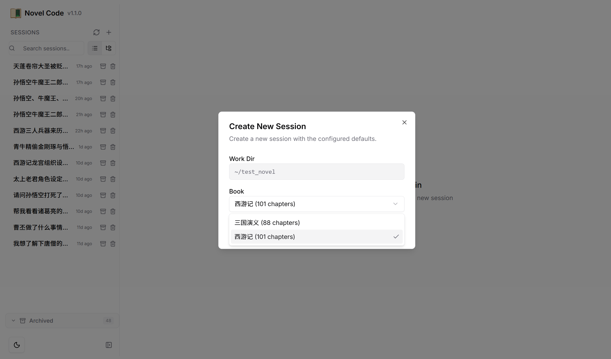

# Web 界面使用指南

Novel CLI 提供了基于浏览器的 Web 界面，支持实时对话、会话管理、文件浏览等功能，适合需要图形化操作的场景。

## 技术架构

Web 界面采用前后端分离架构：

- **前端**：React 19 + TypeScript + Vite + Tailwind CSS + Radix UI
- **后端**：FastAPI + WebSocket + Worker 进程
- **通信**：JSON-RPC over WebSocket + REST API

## 启动 Web 服务

### 基本用法

```bash
novel-cli web  # 默认启动，访问 http://localhost:5494
```

启动后会自动打开浏览器。如果不需要自动打开，使用 `--no-open`。



### 常用启动方式

```bash
# 局域网访问（绑定 0.0.0.0，其他设备可访问）
novel-cli web --network

# 指定端口
novel-cli web --port 8080

# 不自动打开浏览器
novel-cli web --no-open

# 指定默认书籍和 Agent
novel-cli web --book 西游记 --agent default
novel-cli web --agent-file agents/novel-unified-v3/agent.yaml

# 指定工作目录
novel-cli web --work-dir /home/user/novel_data
```

### 启动参数

| 参数 | 缩写 | 说明 | 默认值 |
|------|------|------|--------|
| `--host` | `-h` | 绑定 IP 地址 | `127.0.0.1` |
| `--network` | `-n` | 局域网访问（绑定 `0.0.0.0`） | `false` |
| `--port` | `-p` | 端口号 | `5494` |
| `--reload` | | 启用自动重载（开发模式） | `false` |
| `--open` / `--no-open` | | 自动打开浏览器 | `true` |
| `--auth-token` | | API 认证 Bearer 令牌 | 无 |
| `--allowed-origins` | | CORS 允许的 Origin（逗号分隔） | 无 |
| `--dangerously-omit-auth` | | 禁用认证（公网危险） | `false` |
| `--restrict-sensitive-apis` | | 禁用敏感 API | 公网模式 `true`，其他模式 `false` |
| `--lan-only` / `--public` | | LAN 限制 / 公网访问 | `lan-only` |
| `--agent` | | 内置 Agent 名称（与 `--agent-file` 互斥） | `default` |
| `--agent-file` | | 外置 Agent 文件路径 | 无 |
| `--book` | | 新会话默认书籍 | 无 |
| `--work-dir` | | 默认工作目录 | 当前目录 |

## 访问模式

### 本地访问

最简单的模式，仅本机可访问：

```bash
novel-cli web  # http://localhost:5494
```

### 局域网访问

绑定 `0.0.0.0`，同一局域网内的其他设备（手机、平板、其他电脑）可通过 IP 访问：

```bash
novel-cli web --network
```

启动后终端会显示局域网 IP 地址，其他设备使用 `http://<IP>:5494` 即可访问。

### 公网访问

将服务暴露到公网时，**必须**设置认证令牌：

```bash
novel-cli web --public --auth-token your-secret-token
```

访问时需要在界面中输入令牌完成认证。

> **安全提示**：公网模式必须设置 `--auth-token`，否则任何人都可以访问你的服务。`--restrict-sensitive-apis` 在公网模式下默认开启，会禁用配置写入、文件访问等敏感操作。使用 `--dangerously-omit-auth` 可以禁用认证，但仅在受信任的内部网络中使用，切勿在公网环境下使用。

## 核心功能

### 书籍选择

Web 界面支持通过书籍选择器切换小说：

- 自动列出知识库中所有可用书籍
- 显示每本书的章节数量
- 支持清除选择
- 集成在会话创建对话框中

选择书籍后，Agent 将基于该书籍的知识图谱进行对话。



### Agent 切换

启动时通过 `--agent` 或 `--agent-file` 指定默认 Agent，所有新会话将继承此配置：

```bash
# 使用内置 Agent
novel-cli web --agent default 或不指定 --agent 默认就是 default

# 使用外置 Agent
novel-cli web --agent-file agents/novel-unified-v3/agent.yaml
```

`--agent` 和 `--agent-file` 参数互斥，不可同时使用。

### 会话管理

Web 界面提供完整的会话生命周期管理：

- **创建会话**：指定工作目录、书籍名称
- **删除 / 重命名 / 归档**：支持单会话操作
- **会话分支**：在任意轮次 fork 会话，创建分支探索不同方向
- **自动标题**：AI 根据对话内容自动生成会话标题
- **分页浏览**：默认每页 100 条，支持翻页
- **搜索过滤**：按名称搜索历史会话


### 实时对话

对话功能基于 WebSocket 实现实时流式通信：

- **流式输出**：AI 回复逐字显示，无需等待完整响应
- **文件上传**：支持拖拽或选择上传文件（最大 100MB）
- **虚拟化消息列表**：大对话场景下仍可流畅滚动
- **工具调用审批**：Agent 调用工具时会弹出审批对话框，用户可确认或拒绝
- **子 Agent 活动**：展示子 Agent 的执行状态和结果
- **Markdown 渲染**：支持代码语法高亮、表格、列表等格式


### 文件管理

每个会话关联一个工作目录，Web 界面提供文件浏览器：

- 浏览会话工作区内的文件和目录
- 拖拽上传文件到工作目录
- 查看文件内容和 Git diff
- 敏感路径保护（SSH 密钥、凭证等文件不可访问）

## API 文档

Web 服务启动后，访问 `/docs` 可查看由 FastAPI 自动生成的 Scalar API 文档：

```
http://localhost:5494/docs
```

文档中列出了所有可用的 REST API 端点、请求参数和响应格式，方便进行二次开发或集成。

## 常见问题

### 端口被占用

如果默认端口 `5494` 被占用，使用 `--port` 指定其他端口：

```bash
novel-cli web --port 8080
```

### 局域网无法访问

1. 确认使用了 `--network` 参数
2. 检查防火墙是否放行了对应端口
3. 确认访问设备与服务器在同一局域网内

### 浏览器未自动打开

使用 `--open` 参数强制打开，或手动访问终端中显示的地址。某些远程服务器环境不支持自动打开浏览器，此时需要手动输入地址。
